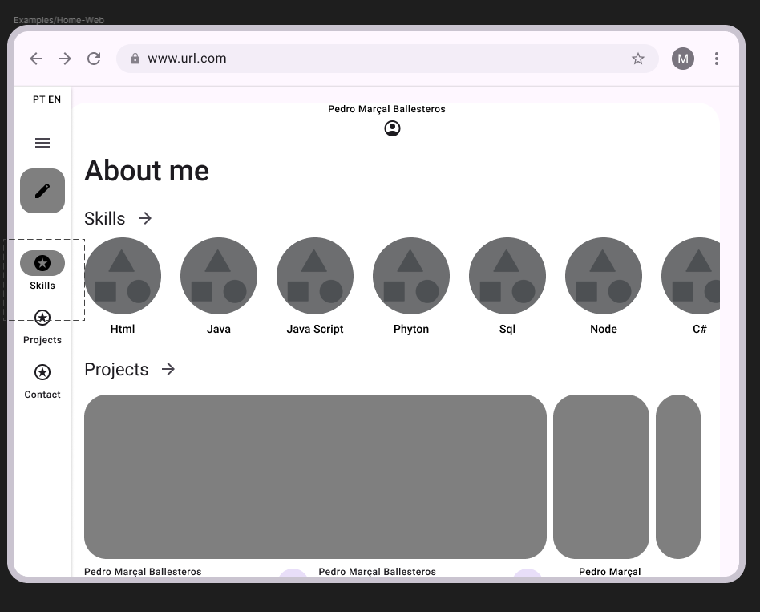

# 🏷️ Portfolio do Gabriel Santos 👨‍💻

> [!NOTE]
> Este projeto é um site de portfólio pessoal criado para apresentar minhas informações profissionais, projetos e contatos de forma organizada.
  Ele consolida minha identidade profissional no ambiente digital, demonstra minhas habilidades técnicas na prática e funciona como um cartão de visitas online.

---

## 🚧 Status do Projeto
📌 Etapa atual: Planejamento, prototipação e estrutura inicial do front-end.

[](https://github.com/Gb1201/portfolio/releases)   

---

## 📚 Índice
- [Links Úteis](#-links-úteis)
- [Sobre o Projeto](#-sobre-o-projeto)
- [Funcionalidades Principais](#-funcionalidades-principais)
- [Tecnologias Utilizadas](#-tecnologias-utilizadas)
- [Instalação e Execução](#-instalação-e-execução)
- [Deploy na Vercel](#-deploy-na-vercel)
- [Estrutura de Pastas](#-estrutura-de-pastas)
- [Demonstração](#-demonstração)
- [Documentações utilizadas](#-documentações-utilizadas)
- [Autores](#-autores)
- [Contribuição](#-contribuição)
- [Agradecimentos](#-agradecimentos)
- [Licença](#-licença)

---

## 🔗 Links Úteis
* 🌐 **Demo Online:** [Acesse a Aplicação Web](https://portfolio-pessoal-delta.vercel.app)
  > 💻 Hospedado na Vercel.

---

## 📝 Sobre o Projeto
Este projeto consiste no desenvolvimento de um site de portfólio pessoal, criado com o objetivo de apresentar de forma organizada minhas informações profissionais, projetos desenvolvidos, experiências e formas de contato.

### 📌 Por que ele existe?

A motivação principal foi consolidar minha identidade profissional no ambiente digital. Como estudante de Engenharia de Software, é fundamental possuir um espaço próprio para demonstrar habilidades técnicas, projetos acadêmicos e experiências práticas.

Além disso, o projeto faz parte de uma atividade acadêmica, permitindo aplicar na prática conceitos de desenvolvimento front-end, organização de layout, componentização e versionamento com Git e GitHub.

---

### 🧩 Qual problema ele resolve?

Muitos estudantes e desenvolvedores iniciantes não possuem um espaço estruturado para apresentar seus projetos e competências de forma profissional.

Este portfólio resolve esse problema ao:

- Centralizar informações profissionais em um único lugar
- Facilitar a visualização de projetos desenvolvidos
- Servir como cartão de visitas digital
- Demonstrar habilidades técnicas na prática

---

### 🚀 Onde pode ser utilizado?

- Processos seletivos de estágio ou emprego
- Compartilhamento em redes profissionais (LinkedIn)
- Apresentação em entrevistas técnicas
- Divulgação pessoal como desenvolvedor

---

## ✨ Funcionalidades Principais

### 🏠 1. Página Inicial (Home)
- Apresentação breve do desenvolvedor
- Destaque para nome e área de atuação
- Navegação intuitiva para as demais seções

### 👤 2. Página "Sobre"
- Descrição profissional
- Formação acadêmica
- Interesses e áreas de especialização

### 💼 3. Página de Projetos
- Listagem de projetos desenvolvidos
- Breve descrição de cada projeto
- Tecnologias utilizadas
- Link para repositório no GitHub

### 🏢 4. Página de Experiências
- Experiências acadêmicas ou profissionais
- Participação em projetos e atividades relevantes

### 📬 5. Página de Contato
- Informações de contato (email, LinkedIn)
- Formulário para envio de mensagens

### 📱 6. Layout Responsivo
- Estrutura adaptável para desktop e mobile

---

## 🛠 Tecnologias Utilizadas

### 💻 Front-end

| Tecnologia | Descrição |
|---|---|
| [Next.js](https://nextjs.org/) | Framework React para aplicações web |
| [TypeScript](https://www.typescriptlang.org/) | Superset tipado do JavaScript |
| [Tailwind CSS](https://tailwindcss.com/) | Framework de estilização utilitária |

### ⚙️ Infraestrutura & DevOps

| Tecnologia | Descrição |
|---|---|
| [Vercel](https://vercel.com/) | Plataforma de hospedagem e deploy |
| [GitHub](https://github.com/) | Versionamento e CI/CD |

---

## 🔧 Instalação e Execução

### Pré-requisitos
* **Node.js** v18 ou superior
* **npm** (incluso com o Node.js)

### Passos

1. Clone o repositório:
```bash
git clone https://github.com/Gb1201/PortfolioPessoal.git
```

2. Acesse a pasta do projeto:
```bash
cd MEUPORTFOLIO
```

3. Instale as dependências:
```bash
npm install
```

4. Execute o projeto em modo de desenvolvimento:
```bash
npm run dev
```

5. Acesse no navegador: `http://localhost:3000`

---

## 🚀 Deploy na Vercel

A forma mais simples de publicar este projeto é através da [Vercel](https://vercel.com/), plataforma otimizada para aplicações Next.js.

### Opção 1 — Deploy pela interface da Vercel (recomendado)

1. Acesse [vercel.com](https://vercel.com/) e faça login com sua conta GitHub.
2. Clique em **"Add New Project"**.
3. Importe o repositório do portfólio.
4. A Vercel detectará automaticamente que é um projeto **Next.js** e configurará o build.
5. Clique em **"Deploy"** e aguarde a publicação.

> 💡 A cada novo `push` para a branch `main`, a Vercel realizará um novo deploy automaticamente.

### Opção 2 — Deploy via CLI

1. Instale a CLI da Vercel:
```bash
npm install -g vercel
```

2. Na raiz do projeto, execute:
```bash
vercel
```

3. Siga as instruções no terminal (login, seleção do projeto, etc.).

4. Para fazer deploy em produção:
```bash
vercel --prod
```

### Variáveis de Ambiente (se necessário)

Caso o projeto utilize variáveis de ambiente, adicione-as no painel da Vercel:

1. Acesse `https://vercel.com/<seu-usuario>/<seu-projeto>/settings/environment-variables`
2. Clique em **"Add"** e insira as variáveis necessárias.

Ou, para desenvolvimento local, crie um arquivo **`.env.local`** na raiz do projeto:
```env
NEXT_PUBLIC_API_URL=https://sua-api.vercel.app/api
```

> **Obs:** Variáveis expostas no front-end do Next.js precisam começar com `NEXT_PUBLIC_`.

---

## 📂 Estrutura de Pastas
```
.
├── .next/                    # ⚡ Arquivos gerados automaticamente pelo Next.js (build)
│
├── app/                      # 🚀 Estrutura principal do App Router (Next.js 13+)
│   ├── globals.css           # 🎨 Estilos globais da aplicação
│   ├── layout.tsx            # 🏗️ Layout raiz da aplicação
│   └── page.tsx              # 🏠 Página inicial (rota "/")
│
├── components/               # 🧱 Componentes reutilizáveis
│   ├── ui/                   # 🎛️ Componentes base de interface
│   ├── about.tsx             # 👤 Seção "Sobre"
│   ├── contact.tsx           # 📞 Seção "Contato"
│   ├── experiences.tsx       # 💼 Seção "Experiências"
│   ├── footer.tsx            # 🔻 Rodapé da aplicação
│   ├── hero.tsx              # 🎯 Seção principal (Hero)
│   ├── navbar.tsx            # 🧭 Barra de navegação
│   ├── projects.tsx          # 📂 Seção de projetos
│   └── theme-provider.tsx    # 🌗 Controle de tema (Dark/Light Mode)
│
├── hooks/                    # 🪝 Hooks customizados
├── lib/                      # 📚 Funções utilitárias e helpers
├── public/                   # 🌐 Arquivos públicos (imagens, ícones, etc.)
├── styles/                   # 🎨 Arquivos de estilo adicionais
│
├── .gitignore                # 🚫 Arquivos ignorados pelo Git
├── components.json           # ⚙️ Configuração de componentes (ex: shadcn/ui)
├── next-env.d.ts             # 🧠 Definições de tipos do Next.js
├── next.config.mjs           # ⚡ Configuração do Next.js
├── package.json              # ⚙️ Dependências e scripts do projeto
├── package-lock.json         # 🔒 Controle de versões das dependências
├── postcss.config.mjs        # 🎨 Configuração do PostCSS
├── tsconfig.json             # 🟦 Configuração do TypeScript
└── README.md                 # 📘 Documentação do projeto
```

---

## 🎥 Demonstração

### 🌐 Wireframes da Aplicação Web

<p align="center">
  
</p>

---

## 🔗 Documentações utilizadas

* 📖 **Framework (Front-end):** [Documentação Oficial do **Next.js**](https://nextjs.org/docs)
* 📖 **Linguagem:** [Documentação Oficial do **TypeScript**](https://www.typescriptlang.org/docs/)
* 📖 **Estilização:** [Documentação Oficial do **Tailwind CSS**](https://tailwindcss.com/docs)
* 📖 **Hospedagem:** [Documentação da **Vercel**](https://vercel.com/docs)
* 📖 **Guia de Estilo:** [**Conventional Commits**](https://www.conventionalcommits.org/en/v1.0.0/)

---

## 👥 Autores

| 👤 Nome | 🖼️ Foto | :octocat: GitHub | 💼 LinkedIn | 📤 Gmail |
|---------|----------|-----------------|-------------|-----------|
| Gabriel Santos  | <div align="center"></div> | <div align="center"><a href="https://github.com/Gb1201"></a></div> | <div align="center"><a href="https://www.linkedin.com/in/gabriel-coelho-765315350/"></a></div> | <div align="center"><a href="mailto:gabrielsscoelho2004@gmail.com"></a></div> |

---

## 🤝 Contribuição

1. Faça um `fork` do projeto.
2. Crie uma branch para sua feature (`git checkout -b feature/minha-feature`).
3. Commit suas mudanças (`git commit -m 'feat: Adiciona nova funcionalidade X'`). **(Utilize [Conventional Commits](https://www.conventionalcommits.org/en/v1.0.0/))**
4. Faça o `push` para a branch (`git push origin feature/minha-feature`).
5. Abra um **Pull Request (PR)**.

---

## 🙏 Agradecimentos

* [**Engenharia de Software PUC Minas**](https://www.instagram.com/engsoftwarepucminas/) - Pelo apoio institucional e fomento às boas práticas de engenharia.
* [**Prof. Dr. João Paulo Aramuni**](https://github.com/joaopauloaramuni) - Pelos valiosos ensinamentos sobre **Arquitetura de Software** e **Padrões de Projeto**.

---

## 📄 Licença

Este projeto é distribuído sob a **[Licença MIT](./LICENSE)**.

---
